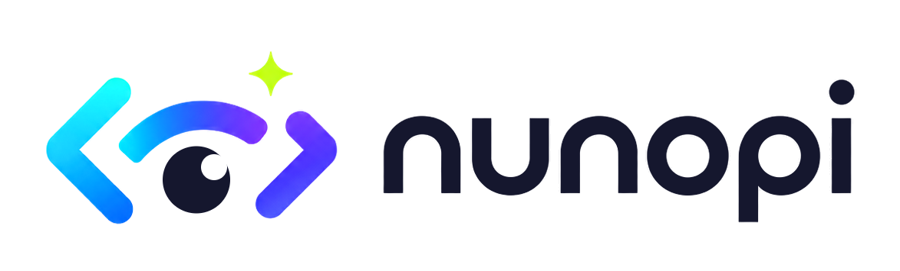

<p align="center">
  <picture>
    <source media="(prefers-color-scheme: dark)" srcset="public/brand/nunopi-lockup-transparent.png">
    
  </picture>
</p>

<p align="center">
  바이브 코더를 위한 AI 코드·글 학습 도구 — 붙여넣으면 한 줄 한 줄, 한 용어 한 용어, 이해하기 쉽게 한 화면에 눈높이로 설명한다.
</p>

---

## 무엇

바이브 코딩은 빠르게 동작하는 코드를 만들지만, 정작 내가 다 이해 못 한 코드가 남는다. 기술 글도 모르는 IT 용어(외계어)로 가득하다.

nunopi는 그 순간을 위한 도구다. 왼쪽에 **코드나 글을 붙여넣으면**, 오른쪽에서 AI 에이전트가 **한 줄/한 용어씩 스트리밍으로** 풀어준다.

- 코드: 각 줄이 무엇을 하는지, 토큰(`useState`, `props`, `async`…)이 뭔지, 어떤 개념이 쓰였는지.
- 글: 글에 나온 IT 용어 사전 + 그 용어를 이해하는 데 필요한 관련 개념.

## 기능

### 코드 분석
- **줄별 설명 스트리밍** — 청크 병렬로 분석해 도착하는 대로 점진 표시(진행률 표시).
- **토큰 사전** — 줄 속 토큰을 클릭하면 on-demand 설명. 북마크 가능.
- **개념 카드** — 코드에 쓰인 개념을 모아 설명.
- **이어서 분석** — 중간에 멈춰도 복원 후 멈춘 지점부터.

### 글(IT 용어) 분석
- **단일 호출 스트리밍** — 용어가 분석되는 대로 하나씩, 이어서 관련 개념도 하나씩.
- **IT 용어 사전 + 관련 개념** — 용어를 클릭하면 관련 개념 카드로 스크롤·강조.
- **원문 용어 하이라이트** — 분석된 글에서 IT 용어를 하이라이트, 클릭하면 학습 패널의 해당 카드로 스크롤.
- **이어서 분석** — 멈춘 지점부터 안 한 용어/개념만.

### 공통
- 분석 결과 **목록(컬렉션)** — 코드/글 모드별로 분리, 히스토리·북마크·HTML 내보내기.
- 라이트/다크 테마.

## Provider

이미 쓰는 AI 도구에 연결한다.

| Provider | 설명 |
|---|---|
| Claude Agent (기본) | 로컬 `claude` CLI (구독 sonnet) |
| Codex Agent | 로컬 `codex` CLI |
| OpenAI-compatible | 사용자 설정 endpoint |

## 아키텍처

```txt
코드/글 입력 (왼쪽 패널)
  ↓
POST /api/agent/analyze  (NDJSON 스트림: progress / partial / result)
  ↓
Provider 어댑터  (claude: --effort low, --tools "" 로 빠른 스트리밍)
  ├─ 코드 → chunkedCodeAnalyze (outline → 줄범위 청크 병렬 → 도착 순 스트리밍)
  └─ 글   → 단일 호출 + 점진 JSON 파싱 (용어/개념 하나씩)
  ↓
LearningPanel (오른쪽)  — 줄별 설명 / 용어 사전 / 관련 개념 점진 표시
```

## Getting Started

```bash
npm install
npm run dev
```

[http://localhost:3000](http://localhost:3000) 접속. (분석엔 로컬 `claude` CLI 등 provider 필요.)

## Scripts

```bash
npm run dev     # 개발 서버
npm run build   # 프로덕션 빌드
npm run lint    # ESLint
```

## Stack

- Next.js 16 (App Router, Turbopack)
- React · TypeScript (strict)
- Tailwind CSS v4
- Monaco Editor · shiki (코드 하이라이트)
- Tabler Icons

## Roadmap

- 데스크톱 앱(Tauri)
- 브랜드 팔레트 UI 정렬 · 파비콘/앱아이콘
- 로고 SVG 벡터화

## Repository

[https://github.com/h1tTAKA/nunopi](https://github.com/h1tTAKA/nunopi)
